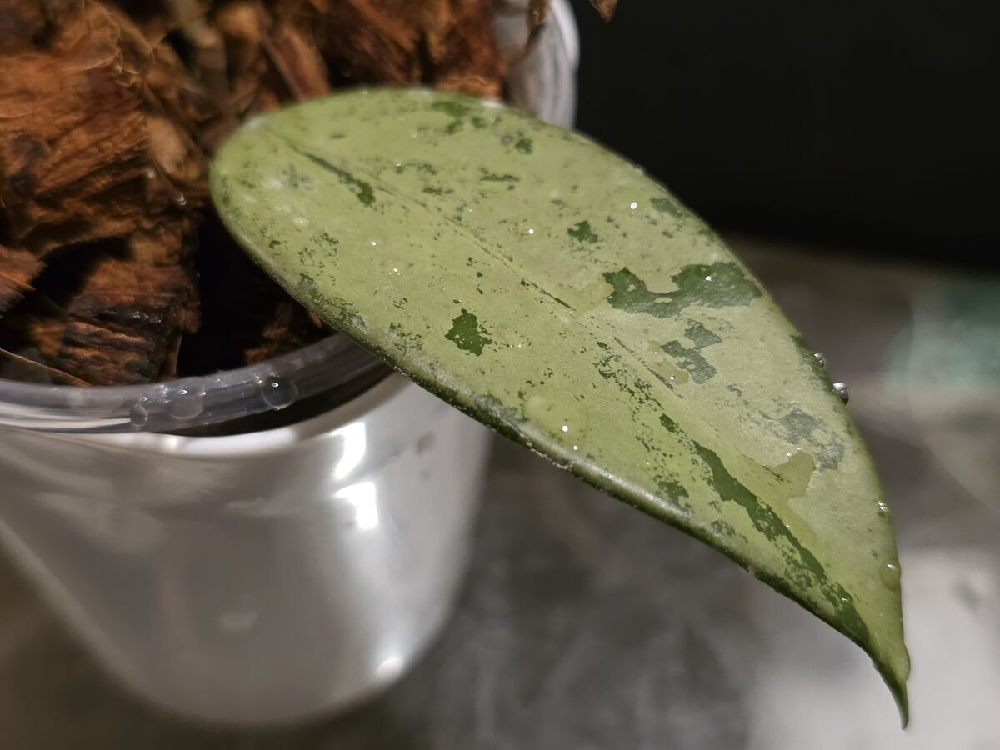
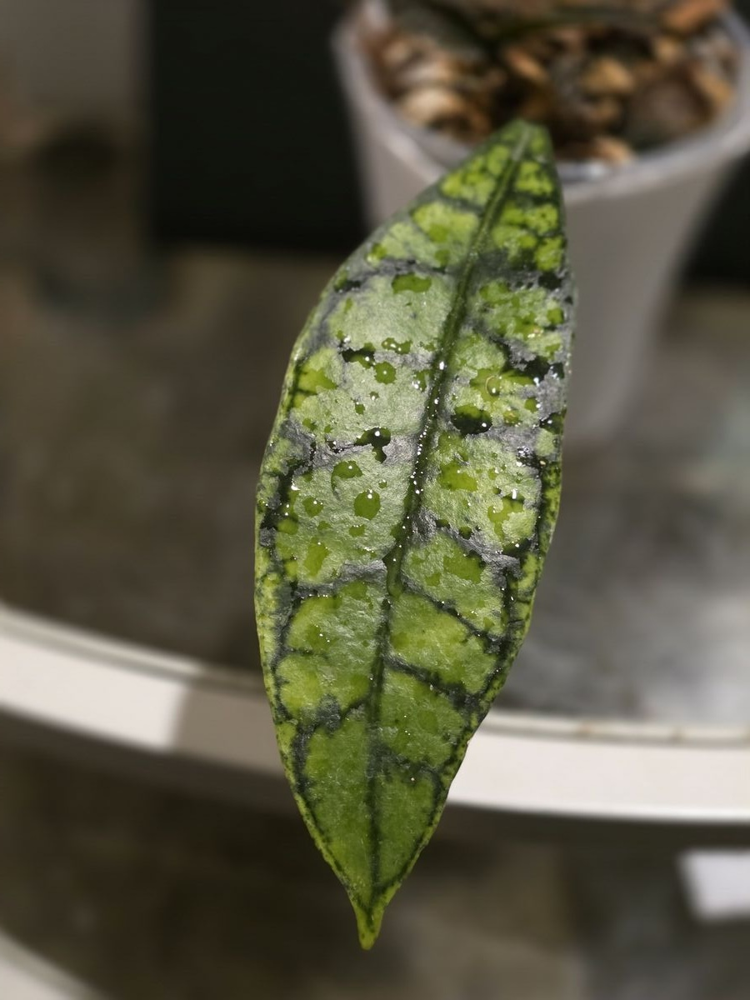
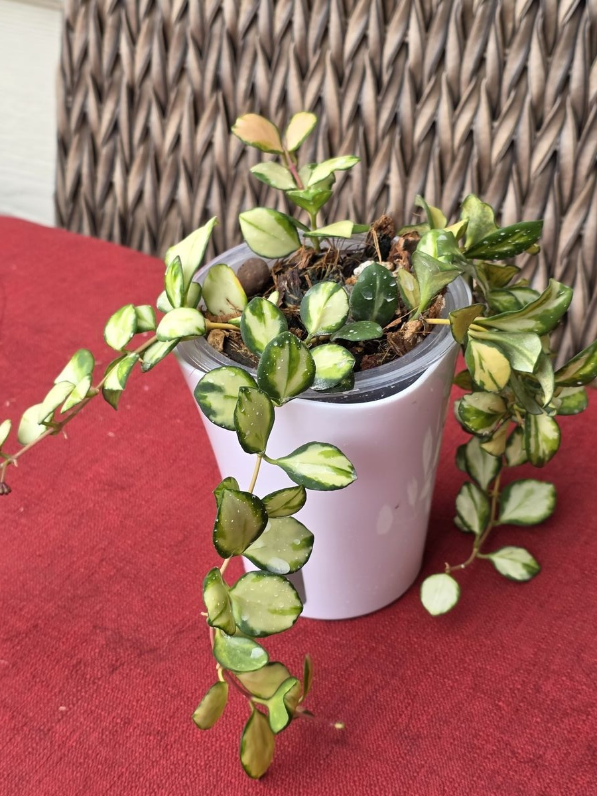
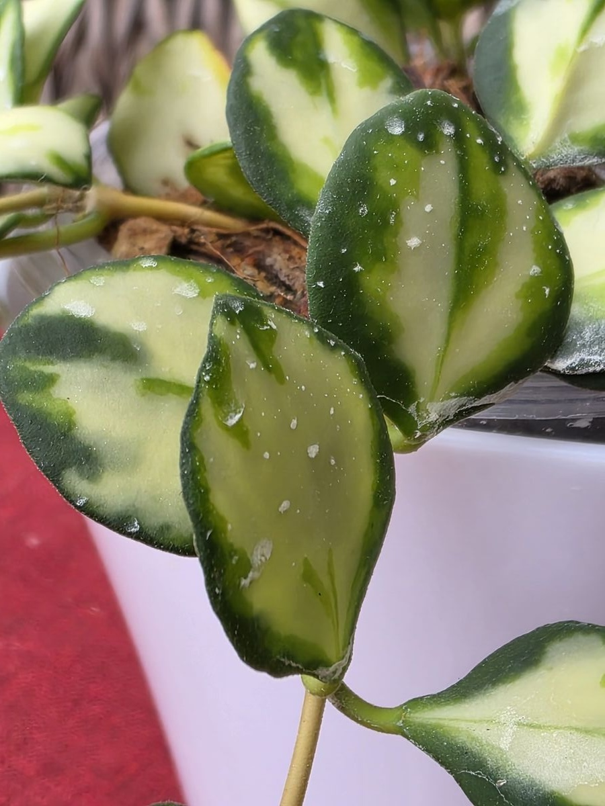

This page demonstrates a simple blog post with an image gallery using a masonry layout. The header image is part of the page bundle so the image lives in the same folder as this markdown file.

## Image Gallery

Below is a masonry-style gallery using the `masonry` shortcode. Click any image to view it in a lightbox.




